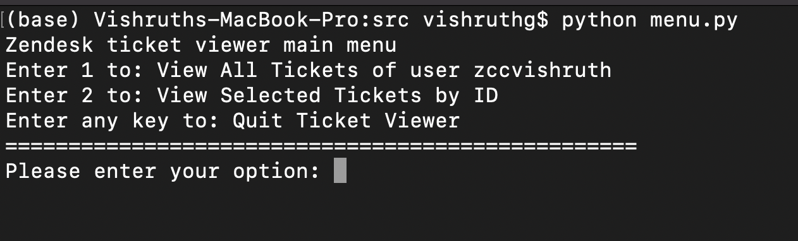
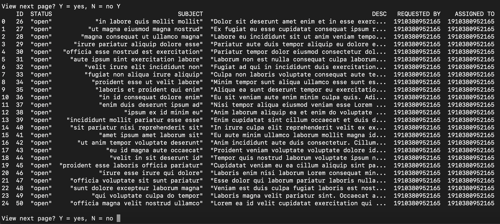
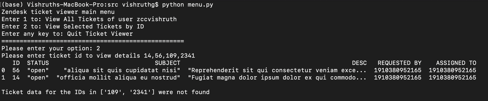
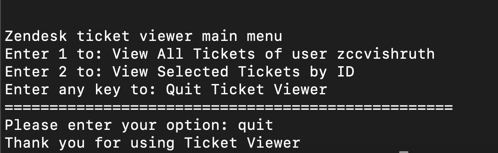

# Zendesk_Coding_Challenge2021
This is my submission to the Zendesk Intern Coding Challenge for 2021

## Packages
This projects makes use of the json, requests and pandas packages. To install the packages required for this project run

```
pip install -r requirements.txt
```

## Running the code
To run the code, clone the repository and navigate to the ```src``` folder. Once in the folder, run 
```
python menu.py
```

## Unit tests
Unit tests for this project are written using the unittest in-built python library. To run the sample test cases run
```
python -m test_file <ticket ID>
```
Please note that this command takes an argument with one or more ticket IDs separated by commas for testing purpose. Running this command with no command line arguments will throw an error.

## Testing on other accounts
To test the project code for other accounts, i.e, view ticket data for other accounts, the following steps have to be done
1. Export email, password, subdomain and API_KEY into environment variables `EMAIL`, `PSWD`, `SUBDOMAIN` and `API_KEY` respectively
2. The python script will parse these variables from the environment variables and connect to API 

(Subdomain that I used is commented in the API_endpoints.py file. Uncomment that line to use my subdomain)

Now it should be possible to run the code on the required account.

## Note
For this project, I have not created a browser interface. It uses a CLI for the operations. The operations allowed are
1. Viewing all tickets
2. Viewing ticket details for selected tickets (for this option the inputs have to be entered with comma for separation)

Other features are:
1. Ticket data displayed are: ID, Status, Subject, Description, Requestor and Assignee ID's
2. Pages through when number of results greater than 25
3. Although I have not added functionality to choose page numbers, pages can be scrolled by hitting Y to access subsequent pages until there are no further pages, at which point the user is redirected back to the main menu
4. Menu looks like this


5. Image showing the second page of the ticket pages


6. Image showing ticket data for select tickets


7. Image showing exit

